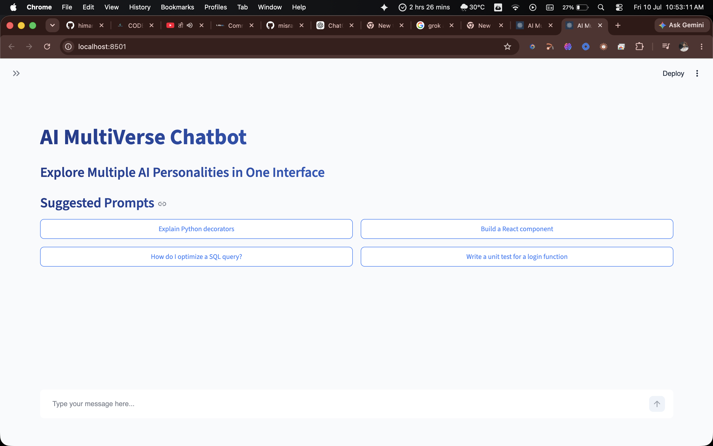
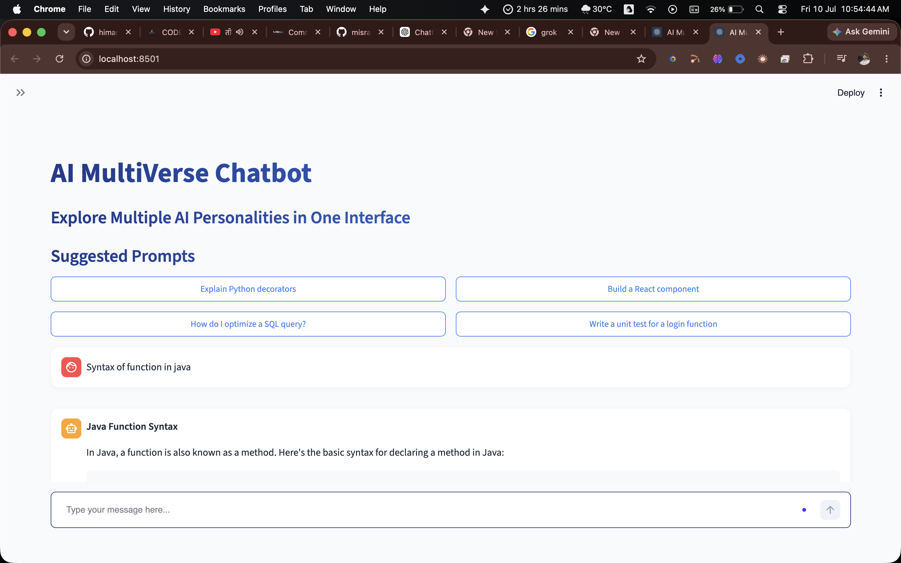
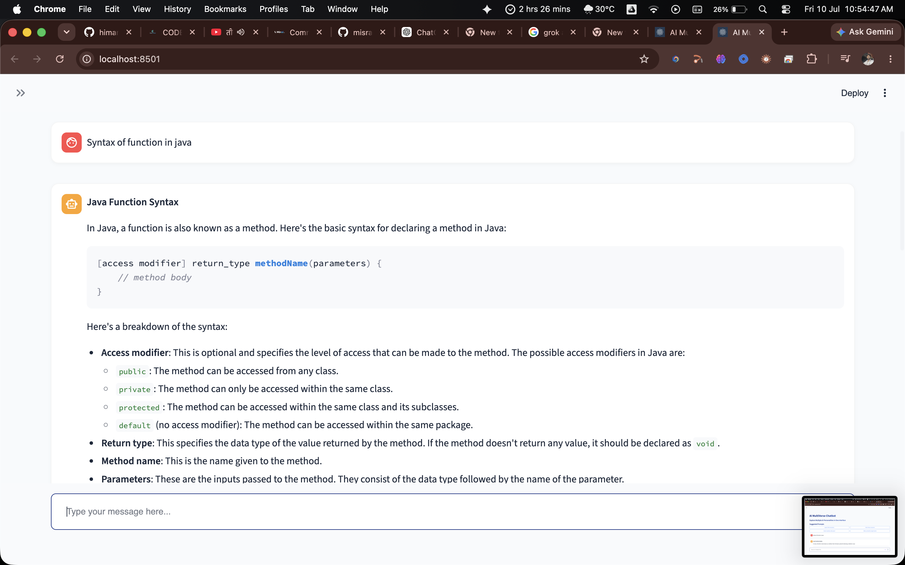
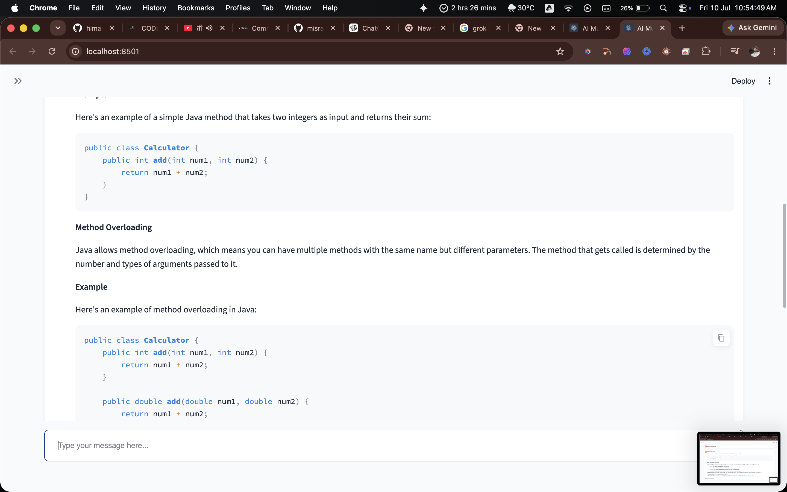
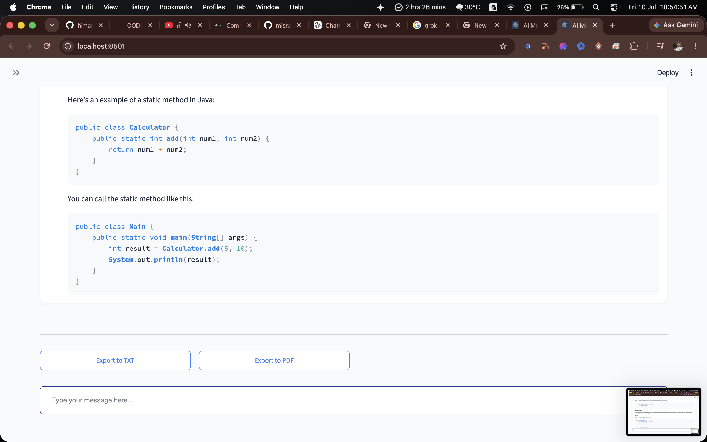

# AI MultiVerse Chatbot

## Project Overview

**AI MultiVerse Chatbot** is a modern, production-quality Streamlit application that provides multiple specialized AI assistants inside a single interface. Powered exclusively by the high-performance **Groq API**, this application is designed to be clean, modular, responsive, scalable, and production-ready.

## Features

- **Multiple AI Personas**: Instantly switch between 7 specialized personas (Coding Assistant, Study Buddy, Career Coach, Content Writer, Translator, Math Tutor, Creative Writer).
- **Groq API Integration**: Lightning-fast inference using models like Llama 3 and Mixtral.
- **Export Capabilities**: Download your conversation history as TXT or PDF formats directly to your local machine.
- **Modern UI**: Clean, professional light theme with glass-like panels, rounded cards, and responsive design.
- **Advanced Controls**: Fine-tune your AI interactions using Temperature and Max Tokens sliders.
- **Prompt Suggestions**: Get started quickly with persona-specific prompt recommendations.
- **Robust Error Handling**: Graceful degradation and clear messaging for network issues or missing credentials.

## Architecture

The application follows a clean architecture pattern, separating UI logic from API communication and utility functions.
- `app.py`: Handles the Streamlit interface and state management.
- `config.py`: Centralized configuration for models, theme colors, and environment variables.
- `prompts.py`: Storage for persona definitions and system prompts.
- `utils/`: Reusable modules for API communication, PDF/TXT export, CSS styling, and helper functions.

## Folder Structure

```text
AI-MultiVerse-Chatbot/
|-- app.py
|-- prompts.py
|-- config.py
|-- requirements.txt
|-- README.md
|-- .env.example
|-- .gitignore
|-- assets/
|   `-- logo.png
|-- utils/
|   |-- groq_client.py
|   |-- helpers.py
|   |-- export_chat.py
|   `-- styles.py
|-- data/
`-- chat_exports/
```

## Tech Stack

- **Language**: Python 3.11+
- **Framework**: Streamlit
- **AI Provider**: Groq API (via Groq Python SDK)
- **Environment Management**: python-dotenv
- **PDF Generation**: fpdf2

## Installation

1. **Clone the repository or navigate to the project directory**:
   ```bash
   cd "Ass-2 AI MultiVerse Chatbot"
   ```

2. **Create a virtual environment (recommended)**:
   ```bash
   python -m venv venv
   source venv/bin/activate  # On Windows use: venv\Scripts\activate
   ```

3. **Install dependencies**:
   ```bash
   pip install -r requirements.txt
   ```

## Environment Variables

The application requires a Groq API key to function.

1. Copy the example environment file:
   ```bash
   cp .env.example .env
   ```
2. Open `.env` and add your Groq API key:
   ```env
   GROQ_API_KEY=your_actual_api_key_here
   ```

## Running the Project

Start the Streamlit development server:

```bash
streamlit run app.py
```

The application will automatically open in your default web browser.

## Configuration

You can customize the application by editing `config.py`. Modify default models, available models, temperature settings, and the color theme directly in this file without altering the core application logic.

## Screenshots







## Future Enhancements

- **Chat History Database**: Implement SQLite or PostgreSQL for persistent, long-term chat history storage.
- **User Authentication**: Add login functionality for personalized experiences and saving individual settings.
- **Voice Input/Output**: Integrate Whisper for speech-to-text and a TTS engine for auditory feedback.
- **Image Generation Persona**: Integrate an image generation model if Groq supports it in the future or via an external API.

## License

This project is licensed under the MIT License. See the LICENSE file for details.

## Author

Developed by Himanshu for Mirai Assignments.
