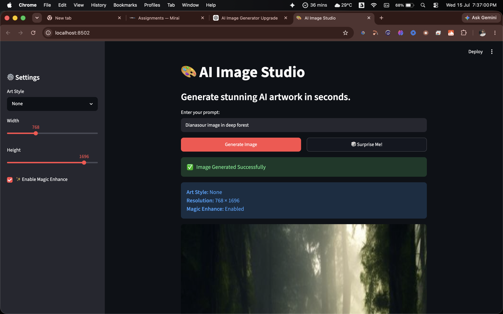
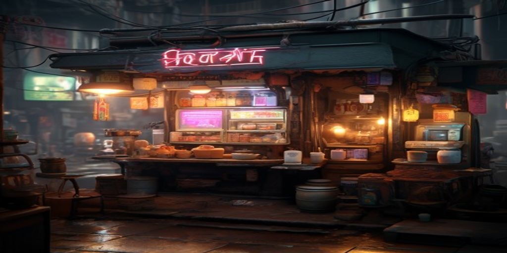

# 🎨 AI Image Studio

A beginner-friendly Streamlit web application that generates stunning AI artwork using the Pollinations AI Image API.



### Example Generation

*(Generated Example: Cyberpunk chai shop in India)*

## ✨ Features

- **Custom Prompt Input**: Describe any scene and generate an image.
- **Surprise Me! 🎲**: Instantly generates an image from 10 creative, pre-written prompts.
- **Magic Enhance ✨**: Automatically appends professional prompt modifiers (e.g. `8k resolution`, `unreal engine 5 render`, `cinematic lighting`) to dramatically improve image quality.
- **Custom Dimensions**: Easily adjust the Width and Height of the generated image.
- **Art Styles**: Choose from various styles like Anime, Photorealistic, Cyberpunk, 3D Render, and more.
- **Easy Download**: One-click download with intelligent file naming based on the chosen art style.
- **Error Handling**: Graceful fallback and user-friendly error messages if network or API issues occur.

## 🚀 How to Run

1. Make sure you have **Streamlit** installed:
   ```bash
   pip install streamlit
   ```

2. Navigate to the project directory and run the application:
   ```bash
   python3 -m streamlit run app.py
   ```

3. The app will automatically open in your default browser at `http://localhost:8501`.

## 🛠️ Technology Stack
- **Python 3**
- **Streamlit** (Frontend UI)
- **urllib** (HTTP Requests & URL Encoding)
- **Pollinations AI** (Image Generation API)
